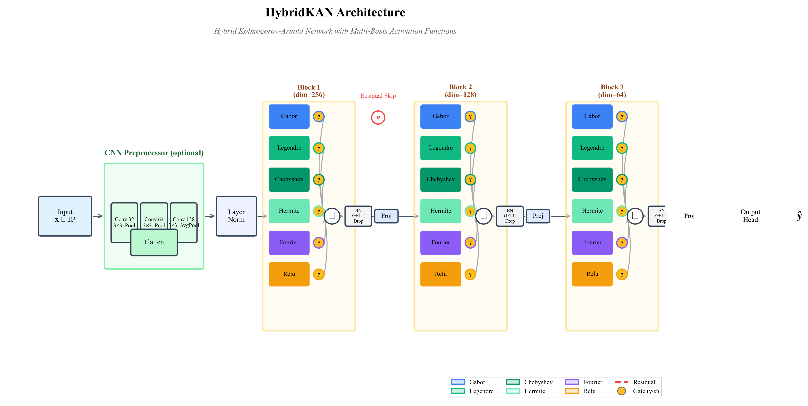
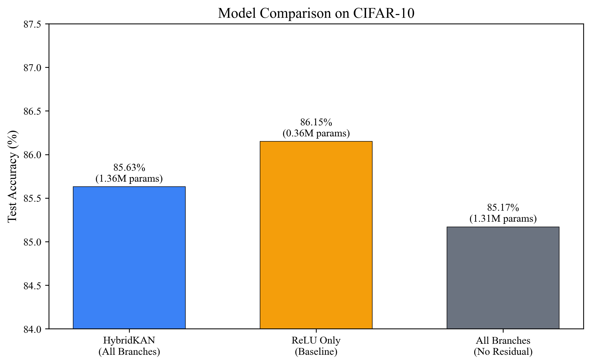
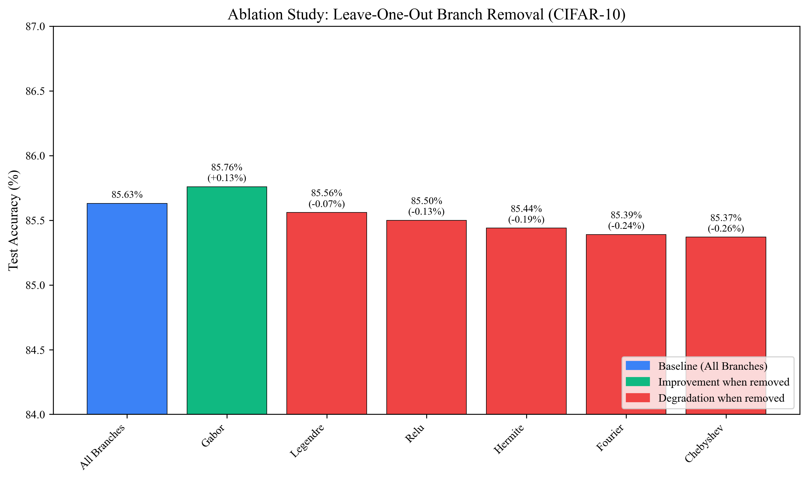
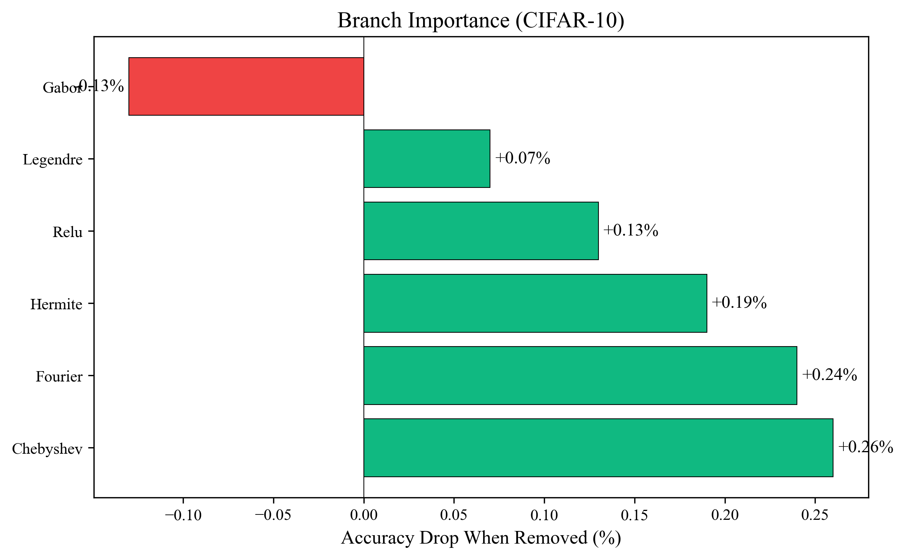
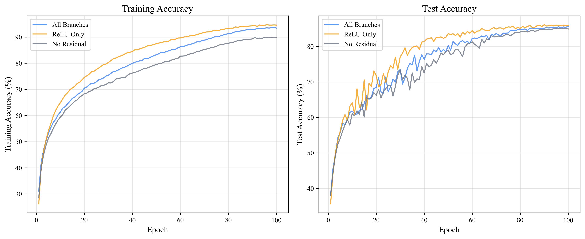

# HybridKAN: Hybrid Kolmogorov-Arnold Networks

<p align="center">
  
</p>

[](https://www.python.org/downloads/)
[](https://pytorch.org/)
[](https://opensource.org/licenses/MIT)

## Overview

**HybridKAN** is a novel neural network architecture that combines multiple mathematical basis functions into a unified framework, inspired by the Kolmogorov-Arnold representation theorem. Unlike traditional networks that rely solely on ReLU activations, HybridKAN employs parallel branches of:

- **Gabor wavelets** — Localized, orientation/frequency-selective representations
- **Legendre polynomials** — Orthogonal basis for smooth global structure
- **Chebyshev polynomials** — Optimal polynomial approximation on [-1, 1]
- **Hermite functions** — Gaussian-weighted polynomials for probabilistic modeling
- **Fourier basis** — Periodic function representation
- **ReLU** — Piecewise-linear baseline

Each branch is equipped with **learnable gates** that enable data-driven specialization, and optional **residual skip connections** with learnable weights for improved gradient flow.

## Key Features

| Feature | Description |
|---------|-------------|
| **Multi-Basis Branches** | Six parallel activation families with learned importance weighting |
| **Learnable Gates** | Per-branch scalar gates (γ) for adaptive branch selection |
| **Residual Connections** | Toggle-able skip connections with learnable gates (α) |
| **Polynomial De-duplication** | Avoids redundant constant/linear terms across polynomial families |
| **CNN Preprocessing** | Optional lightweight CNN for image inputs |
| **Mixed Precision** | AMP support for efficient GPU training |
| **Gate Tracking** | Monitor branch importance evolution during training |

## Installation

```bash
# Clone the repository
git clone https://github.com/yourusername/hybridkan.git
cd hybridkan

# Install in development mode
pip install -e .

# Or install with development dependencies
pip install -e ".[dev]"
```

### Requirements

- Python ≥ 3.8
- PyTorch ≥ 1.12
- CUDA 11.x (optional, for GPU acceleration)

## Quick Start

### Basic Classification (MNIST)

```python
from hybridkan import HybridKAN, Trainer, set_seed
from hybridkan.data import get_mnist_loaders

# Set random seed for reproducibility
set_seed(42)

# Load data
train_loader, test_loader = get_mnist_loaders(
    train_size=60000,
    batch_size=128,
    use_cnn=True,  # Keep image format
)

# Create model with all branches
model = HybridKAN(
    input_dim=784,
    hidden_dims=[256, 128, 64],
    num_classes=10,
    activation_functions='all',
    use_cnn=True,
    cnn_channels=1,
    use_residual=True,
)

# Train
trainer = Trainer(model, train_loader, test_loader)
results = trainer.train()

print(f"Best Accuracy: {results['best_accuracy']:.2f}%")
```

### CIFAR-10 with Custom Branches

```python
from hybridkan import HybridKAN
from hybridkan.data import get_cifar10_loaders

train_loader, test_loader = get_cifar10_loaders(
    train_size=50000,
    batch_size=128,
    augment=True,
)

# Use specific branches only
model = HybridKAN(
    input_dim=3072,
    hidden_dims=[512, 256, 128],
    num_classes=10,
    activation_functions=['fourier', 'legendre', 'relu'],
    use_cnn=True,
    cnn_channels=3,
    cnn_output_dim=384,
)
```

### Toggle Residual Connections

```python
model = HybridKAN(
    input_dim=784,
    hidden_dims=[256, 128],
    num_classes=10,
    use_residual=True,       # Enable skip connections
    residual_every_n=1,      # Skip connection every N blocks
)

# Runtime toggle
model.set_residual_enabled(False)  # Disable residuals
model.set_residual_enabled(True)   # Re-enable residuals
```

### Extract Gate Weights

```python
# Branch gates (per layer, per branch)
branch_gates = model.get_branch_gate_weights()
# {0: {'gabor': 0.21, 'legendre': 0.45, ...}, 1: {...}}

# Residual gates
residual_gates = model.get_residual_gate_weights()
# {'residual_gate_0': 0.34, 'residual_gate_1': 0.28}

# All gates combined
all_gates = model.get_all_gate_weights()
```

## Architecture Details

### HybridKAN Block

Each block performs:

1. **Parallel Branch Computation**: All active branches process the input simultaneously
2. **Per-Branch LayerNorm**: Stabilizes scale across heterogeneous bases
3. **Learnable Gating**: Scalar multiplier (γ) per branch
4. **Concatenation**: Branch outputs are concatenated
5. **Post-Processing**: BatchNorm → GELU → Dropout → Linear Projection
6. **Residual Addition**: Optional gated skip connection (α)

### Gate Initialization

| Branch | Initial Gate (γ) | Rationale |
|--------|------------------|-----------|
| ReLU | 0.5 | Strong baseline |
| Legendre | 0.4 | Smooth polynomial |
| Chebyshev | 0.4 | Optimal approximation |
| Hermite | 0.4 | Gaussian-weighted |
| Fourier | 0.4 | Periodic |
| Gabor | 0.2 | Prevent early domination |

### Polynomial De-duplication

To avoid redundant constant (deg-0) and linear (deg-1) terms across polynomial families:
- **Legendre** keeps degrees 0, 1, 2, ..., 8
- **Chebyshev** starts at degree 2
- **Hermite** starts at degree 2

This is controlled via `dedup_poly_deg01=True` and `keep01_family='legendre'`.

## Experimental Results

*Experiments conducted on NVIDIA GeForce RTX 3060 Laptop GPU with PyTorch 2.5.1*

### Classification Performance

<p align="center">
  
</p>

| Model | MNIST | CIFAR-10 |
|-------|-------|----------|
| ReLU Only | 99.50% | 86.15% |
| HybridKAN (All) | 99.44% | 85.63% |
| All (No Residual) | 99.36% | 85.17% |

### Ablation Study (Leave-One-Out on CIFAR-10)

<p align="center">
  
</p>

| Excluded Branch | Accuracy | Δ from All |
|-----------------|----------|------------|
| None (All) | 85.63% | — |
| - Gabor | 85.76% | +0.13% |
| - Legendre | 85.56% | -0.07% |
| - Chebyshev | 85.37% | -0.26% |
| - Hermite | 85.44% | -0.19% |
| - Fourier | 85.39% | -0.24% |
| - ReLU | 85.50% | -0.13% |

### Branch Importance

<p align="center">
  
</p>

### Training Dynamics

<p align="center">
  
</p>

### Learned Gate Weights

The network learns to specialize different branches across layers:

<p align="center">
  
</p>

<p align="center">
  
</p>

### Key Findings

1. **Residual connections provide +0.46% improvement** (85.17% → 85.63%)
2. **Most impactful branches**: Chebyshev (-0.26%) and Fourier (-0.24%)
3. **Gabor may be redundant** for this task (+0.13% when removed)
4. **Learned gate weights** show layer-specific specialization:
   - Early layers: Gabor dominates for feature detection
   - Later layers: Balanced mix with ReLU and polynomials

## Visualization

### Generate Architecture Diagram

```python
from hybridkan.visualization import create_architecture_diagram

fig = create_architecture_diagram(
    hidden_dims=[256, 128, 64],
    branches=['gabor', 'legendre', 'chebyshev', 'hermite', 'fourier', 'relu'],
    use_residual=True,
    show_gates=True,
    output_path='architecture.pdf',
    dpi=1200,  # Publication quality
)
```

### Plot Training Curves

```python
from hybridkan.visualization import plot_training_curves, plot_gate_evolution

# Training curves
plot_training_curves('results/logs/experiment_metrics.csv')

# Gate evolution
plot_gate_evolution('results/logs/experiment_gates.json')
```

## Project Structure

```
hybridkan/
├── hybridkan/
│   ├── __init__.py          # Package exports
│   ├── activations.py       # Basis function implementations
│   ├── model.py             # HybridKAN architecture
│   ├── trainer.py           # Training infrastructure
│   ├── data.py              # Data loading utilities
│   ├── utils.py             # General utilities
│   └── visualization.py     # Plotting functions
├── notebooks/
│   └── HybridKAN_Demo.ipynb # Interactive tutorial
├── figures/
│   └── *.pdf               # Architecture diagrams
├── setup.py
├── requirements.txt
└── README.md
```

## Citation

> **Note:** This is a preliminary demonstration/preprint. The work is ongoing and not yet finalized for formal publication.

If you find this work useful, please cite:

```bibtex
@misc{bandari2024hybridkan,
  title={HybridKAN: Hybrid Kolmogorov-Arnold Networks with Multi-Basis Activation Functions},
  author={Bandari, Esfandiar and Saidov, Rob and Kavishwar, Shruti},
  year={2024},
  note={Preprint - Work in Progress},
  howpublished={\url{https://github.com/RobSaidov/hybrid-kan-research}}
}
```

## Authors

- **Dr. Esfandiar Bandari** - *Lead Researcher*
- **Shruti Kavishwar** - *Contributor*
- **Rob Saidov** - *Contributor*


## License

This project is licensed under the MIT License - see the [LICENSE](LICENSE) file for details.

## Acknowledgments

- Lead research by Dr. Esfandiar Bandari
- Implementation and experiments by Rob Saidov and Shruti Kavishwar
- Inspired by the Kolmogorov-Arnold representation theorem
- PyTorch team for the deep learning framework
